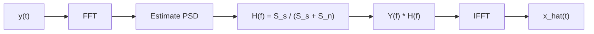

# Classical Signal Processing

Classical methods for seismic signal processing and noise attenuation.

## Wiener Filter

Frequency-domain optimal linear filter for stationary noise removal.

### Theory

The Wiener filter minimizes mean squared error between estimated and true signal:

```
H(f) = S_xx(f) / (S_xx(f) + S_nn(f))
```

Where:
- `S_xx(f)` = signal power spectral density
- `S_nn(f)` = noise power spectral density

### Algorithm



### Implementation

**Python:**
```python
from promethium.signal.filters import wiener_filter
denoised = wiener_filter(noisy_signal, noise_var=0.1)
```

**R:**
```r
denoised <- wiener_filter(noisy_signal, noise_var = 0.1)
```

**Julia:**
```julia
denoised = wiener_filter(noisy_signal; noise_var=0.1)
```

## Adaptive Filters

### LMS (Least Mean Squares)

Iteratively adapts filter coefficients to minimize error:

```
w(n+1) = w(n) + mu * e(n) * x(n)
```

### Kalman Filter

Optimal recursive estimator for linear dynamical systems:

1. Predict state
2. Update with measurement
3. Compute Kalman gain

## Deconvolution

Recover source wavelet and reflectivity from recorded trace.

### Spiking Deconvolution

Compress wavelet to approximate spike, enhancing vertical resolution.

### Predictive Deconvolution

Remove multiple reflections using prediction-error filtering.

## Time-Frequency Analysis

### STFT (Short-Time Fourier Transform)

```
STFT{x(t)}(tau, f) = integral x(t) * w(t - tau) * exp(-j*2*pi*f*t) dt
```

### Wavelet Transform

Multi-resolution analysis using scaled and translated wavelets.

| Wavelet | Application |
|---------|-------------|
| Ricker | Seismic source signature |
| Morlet | Time-frequency analysis |
| Daubechies | Compression, denoising |

## References

1. Wiener, N. (1949). Extrapolation, Interpolation, and Smoothing of Stationary Time Series.
2. Robinson, E.A. (1967). Statistical Communication and Detection.
