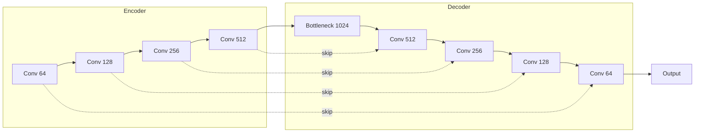

# Deep Learning Models

Promethium includes state-of-the-art deep learning architectures for seismic data reconstruction.

## U-Net

Encoder-decoder architecture with skip connections for interpolation and denoising.

### Architecture



### Specification

| Component | Configuration |
|-----------|--------------|
| Input | `(batch, 1, height, width)` |
| Encoder levels | 4 |
| Base channels | 64 |
| Activation | LeakyReLU(0.2) |
| Normalization | BatchNorm |
| Skip connections | Concatenation |
| Output | `(batch, 1, height, width)` |

### Training

```python
from promethium.ml.models import UNet
from promethium.ml.training import Trainer

model = UNet(in_channels=1, out_channels=1, depth=4)
trainer = Trainer(model, loss="mse+spectral", optimizer="adam")
trainer.fit(train_loader, epochs=100)
```

## Autoencoder

Symmetric encoder-decoder for unsupervised denoising.

### Architecture

| Stage | Layers |
|-------|--------|
| Encoder | Conv(64) -> Conv(128) -> Conv(256) |
| Bottleneck | Conv(512) |
| Decoder | ConvT(256) -> ConvT(128) -> ConvT(64) |

### Loss Function

Reconstruction loss with optional regularization:

```
L = MSE(x, x_hat) + lambda * ||z||_1
```

## GAN (Generative Adversarial Network)

Generator-discriminator architecture for high-fidelity reconstruction.

### Components

**Generator:** U-Net style encoder-decoder  
**Discriminator:** PatchGAN classifier

### Loss Functions

| Loss | Formula |
|------|---------|
| Adversarial | `E[log(D(x))] + E[log(1 - D(G(z)))]` |
| Reconstruction | `||x - G(z)||_1` |
| Perceptual | `||VGG(x) - VGG(G(z))||_2` |

## Implementation

### Python

```python
from promethium.ml.models import UNet, Autoencoder, SeismicGAN
```

### Julia

```julia
# Flux.jl-based implementation
using Promethium: UNet
model = UNet(depth=4, base_channels=64)
```

### Scala

```scala
import io.promethium.ml.UNet
val model = UNet(depth = 4, baseChannels = 64)
```

## Pre-trained Models

| Model | Application | Size |
|-------|-------------|------|
| `unet_denoise_v1` | General denoising | 45 MB |
| `unet_interp_v1` | Missing trace interpolation | 45 MB |
| `autoencoder_v1` | Unsupervised denoising | 12 MB |
