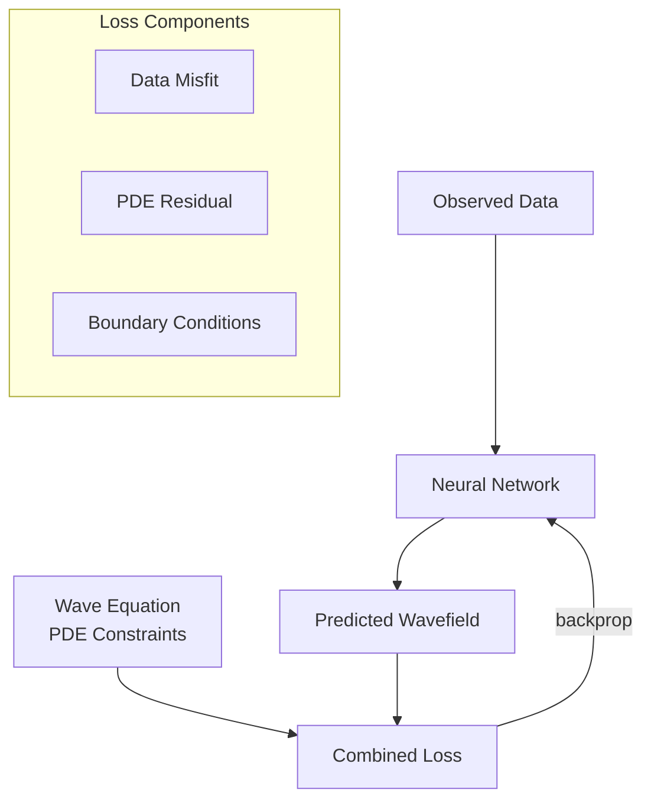

# Physics-Informed Neural Networks (PINNs)

Neural networks constrained by physical laws for seismic reconstruction.

## Concept

PINNs incorporate partial differential equations (PDEs) directly into the loss function, ensuring physically consistent reconstructions.



## Wave Equation Constraint

For acoustic wave propagation:

```
d2u/dt2 = c^2 * (d2u/dx2 + d2u/dz2)
```

The PDE residual is computed via automatic differentiation:

```python
u_tt = d2u_dt2(u_pred)
u_xx = d2u_dx2(u_pred)
pde_residual = u_tt - c**2 * (u_xx + u_zz)
```

## Loss Function

```
L_total = lambda_data * L_data + lambda_pde * L_pde + lambda_bc * L_bc
```

| Component | Formula | Purpose |
|-----------|---------|---------|
| Data loss | `MSE(u_pred, u_obs)` | Match observations |
| PDE loss | `mean(pde_residual^2)` | Satisfy wave equation |
| BC loss | `MSE(u_boundary, u_bc)` | Boundary conditions |

## Architecture

| Layer | Configuration |
|-------|--------------|
| Input | `(x, z, t)` coordinates |
| Hidden | 8 layers, 256 neurons each |
| Activation | Tanh |
| Output | `u(x, z, t)` wavefield |

## Implementation

### Python

```python
from promethium.ml.pinns import SeismicPINN

pinn = SeismicPINN(
    velocity_model=velocity,
    hidden_layers=8,
    hidden_dim=256
)
pinn.train(observed_data, epochs=10000)
recovered = pinn.predict(full_grid)
```

### Training Strategy

1. **Collocation points:** Sample PDE residual at random domain points
2. **Adaptive weighting:** Balance data and physics losses dynamically
3. **Transfer learning:** Pre-train on synthetic data, fine-tune on real data

## Applications

| Application | Description |
|-------------|-------------|
| Wavefield reconstruction | Recover full wavefield from sparse observations |
| Velocity inversion | Joint recovery of wavefield and velocity |
| Multiple attenuation | Physics-guided multiple removal |

## Advantages

- Regularization through physical constraints
- Generalization to unseen scenarios
- Reduced data requirements
- Interpretable solutions

## References

1. Raissi, M., Perdikaris, P., & Karniadakis, G.E. (2019). Physics-informed neural networks.
2. Rasht-Behesht, M., et al. (2022). Physics-informed neural networks for seismic inversion.
