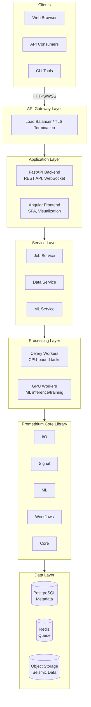
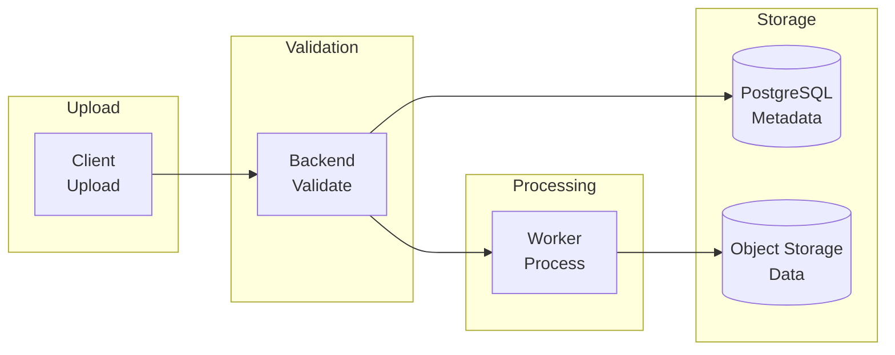
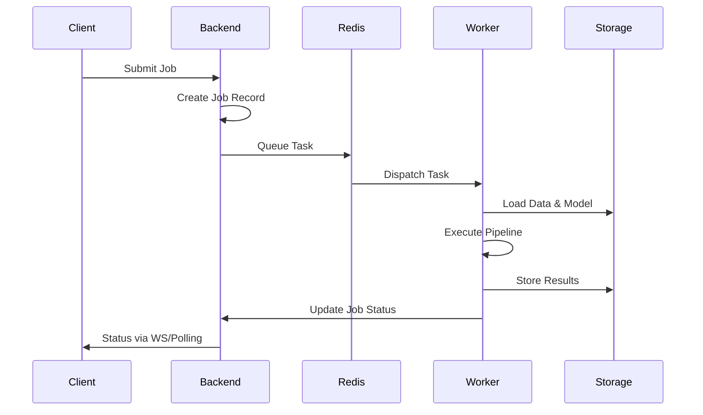
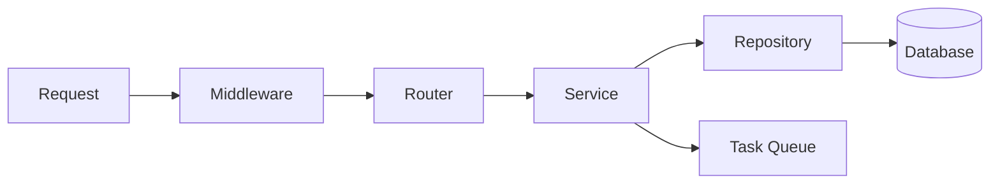
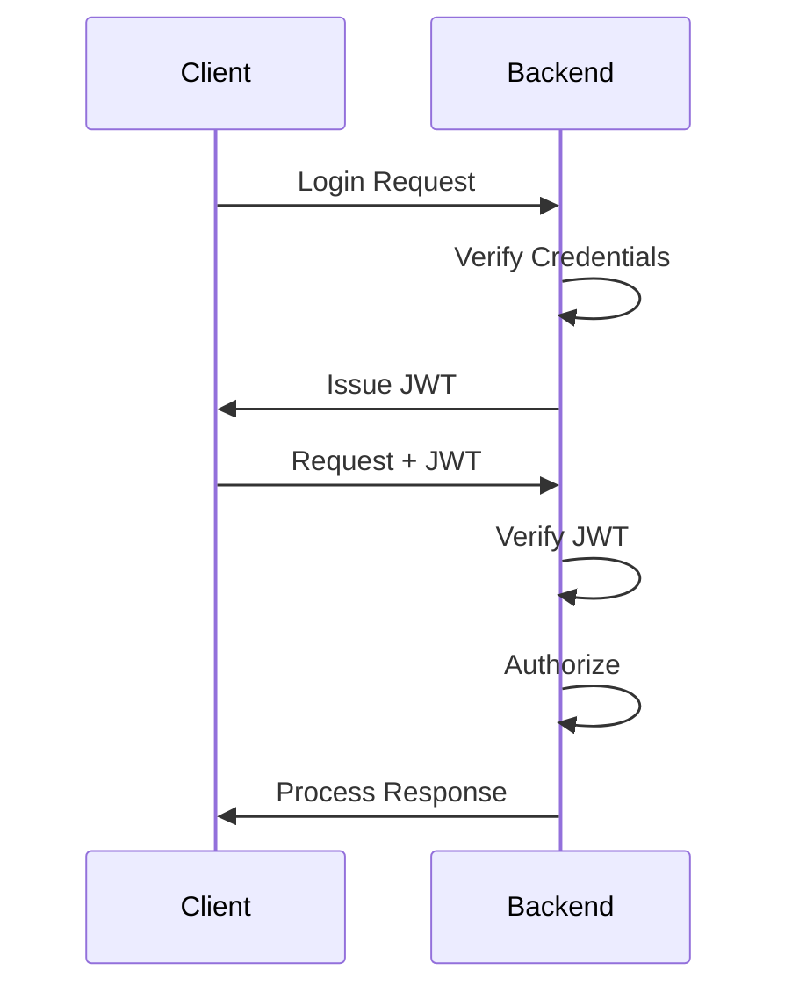
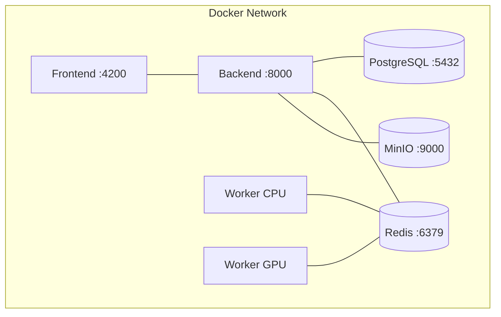
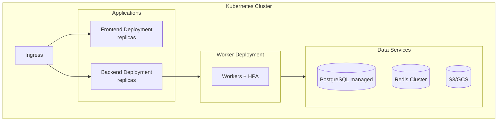

# Architecture

This document provides a comprehensive architectural overview of the Promethium framework, describing its components, interactions, and design decisions.

## Table of Contents

- [Architectural Overview](#architectural-overview)
- [System Components](#system-components)
- [Data Flow](#data-flow)
- [Core Library Architecture](#core-library-architecture)
- [Backend API Architecture](#backend-api-architecture)
- [Worker Architecture](#worker-architecture)
- [Frontend Architecture](#frontend-architecture)
- [Data Storage Architecture](#data-storage-architecture)
- [Security Architecture](#security-architecture)
- [Deployment Architecture](#deployment-architecture)
- [Design Decisions](#design-decisions)

---

## Architectural Overview

Promethium implements a state-of-the-art modular, service-oriented architecture designed for scalability, maintainability, and extensibility. Initiated in December 2025, the system leverages cutting-edge technologies and separates concerns across distinct layers, enabling independent development and deployment of components.



---

## System Components

### Frontend (Angular Application)

The Angular single-page application provides the user interface for:

| Component | Responsibility |
|-----------|----------------|
| Visualization Module | Interactive seismic data display with D3.js and Plotly |
| Job Manager | Job submission, monitoring, and management |
| Data Browser | Dataset exploration and selection |
| Configuration UI | Model and pipeline parameter configuration |
| User Management | Authentication, profile, and preferences |
| Result Viewer | Reconstruction results with comparison tools |

**Technology Stack:**
- Angular 17+ with standalone components
- TypeScript with strict mode
- NgRx for state management
- RxJS for reactive programming
- Angular Material for UI components

### Backend API (FastAPI Application)

The FastAPI backend provides the RESTful API layer:

| Module | Responsibility |
|--------|----------------|
| Authentication | JWT-based authentication and authorization |
| Jobs Router | Job CRUD operations and status endpoints |
| Data Router | Dataset management and streaming endpoints |
| Models Router | ML model registry and selection endpoints |
| Results Router | Result retrieval and export endpoints |
| Health Router | Health checks for orchestration systems |

**Technology Stack:**
- FastAPI with async/await patterns
- Pydantic for request/response validation
- SQLAlchemy for ORM
- python-jose for JWT handling
- WebSocket support for real-time updates

### Worker Pool (Celery Workers)

Distributed workers execute compute-intensive tasks:

| Worker Type | Task Types | Resources |
|-------------|------------|-----------|
| CPU Workers | Filtering, spectral analysis, format conversion | Multi-core CPU |
| GPU Workers | ML inference, training, denoising | NVIDIA GPU |
| IO Workers | Data ingestion, export, transfer | High I/O bandwidth |

**Task Categories:**
- `promethium.tasks.preprocess`: Data preprocessing pipelines
- `promethium.tasks.reconstruct`: Reconstruction job execution
- `promethium.tasks.train`: Model training workflows
- `promethium.tasks.export`: Result export and packaging

### Core Library

The Promethium core library contains domain logic:

**Package Structure:**
```
promethium/
├── core/           # Configuration, logging, exceptions
├── io/             # Format readers and writers
├── signal/         # Signal processing algorithms
├── ml/             # Machine learning models and training
└── workflows/      # High-level pipeline definitions
```

---

## Data Flow

### Ingestion Flow



1. Client uploads seismic file via API
2. Backend validates headers and creates metadata record
3. Backend queues ingestion task
4. Worker parses file, extracts metadata, stores data
5. Worker updates metadata with statistics and status

### Reconstruction Flow



1. Client submits reconstruction job request
2. Backend validates parameters, creates job record
3. Backend queues task to Redis
4. Worker picks up task, loads data and model
5. Worker executes reconstruction pipeline
6. Worker stores results and updates job status
7. Client receives status via polling or WebSocket

---

## Core Library Architecture

### I/O Module

The I/O module provides format-agnostic data access:

```
io/
├── base.py          # Abstract reader/writer interfaces
├── segy.py          # SEG-Y format implementation
├── miniseed.py      # miniSEED format implementation
├── sac.py           # SAC format implementation
├── formats.py       # Format detection and dispatch
└── streaming.py     # Streaming reader for large files
```

**Key Abstractions:**
- `SeismicReader`: Abstract base for format readers
- `SeismicWriter`: Abstract base for format writers
- `SeismicData`: Unified data container with xarray backend
- `TraceHeader`: Standardized header representation

### Signal Module

Signal processing implementations:

```
signal/
├── filtering.py     # FIR/IIR filter design and application
├── transforms.py    # FFT, wavelet, S-transform
├── spectral.py      # Spectral estimation and analysis
├── deconvolution.py # Predictive and spiking deconvolution
├── interpolation.py # Trace interpolation methods
└── qc.py            # Quality control metrics
```

**Design Patterns:**
- Functional API for stateless operations
- NumPy array operations for performance
- Optional GPU acceleration via CuPy

### ML Module

Machine learning model implementations:

```
ml/
├── models/
│   ├── base.py      # Abstract model interface
│   ├── unet.py      # U-Net variants
│   ├── autoencoder.py # VAE and denoising autoencoders
│   ├── gan.py       # GAN architectures
│   └── pinn.py      # Physics-informed networks
├── training.py      # Training loop and utilities
├── inference.py     # Inference pipeline
├── metrics.py       # Evaluation metrics
├── datasets.py      # PyTorch dataset classes
└── transforms.py    # Data augmentation
```

**Model Interface:**
```python
class ReconstructionModel(ABC):
    @abstractmethod
    def forward(self, x: Tensor, mask: Tensor) -> Tensor:
        """Reconstruct masked input."""
        
    @abstractmethod
    def loss(self, pred: Tensor, target: Tensor) -> Tensor:
        """Compute reconstruction loss."""
```

---

## Backend API Architecture

### Layer Organization

```
api/
├── main.py          # Application factory and startup
├── dependencies.py  # Dependency injection
├── routers/
│   ├── auth.py      # Authentication endpoints
│   ├── jobs.py      # Job management endpoints
│   ├── data.py      # Data management endpoints
│   ├── models.py    # Model registry endpoints
│   └── health.py    # Health check endpoints
├── models/
│   ├── requests.py  # Request schemas
│   └── responses.py # Response schemas
├── services/
│   ├── job_service.py    # Job business logic
│   ├── data_service.py   # Data business logic
│   └── model_service.py  # Model business logic
└── middleware/
    ├── auth.py      # Authentication middleware
    └── logging.py   # Request logging middleware
```

### Request Flow



### API Versioning

API versioning is managed through URL prefixes:

- `/api/v1/` - Current stable API
- `/api/v2/` - Future API versions (when needed)

---

## Worker Architecture

### Task Definition

```python
@celery_app.task(
    bind=True,
    max_retries=3,
    default_retry_delay=60,
    acks_late=True,
)
def reconstruct_task(
    self,
    job_id: str,
    dataset_id: str,
    model_id: str,
    parameters: dict,
) -> dict:
    """Execute reconstruction job."""
    ...
```

### Worker Types

| Worker | Concurrency | Queue | Resources |
|--------|-------------|-------|-----------|
| default | 4 | default | 4 CPU cores |
| gpu | 1 | gpu | 1 GPU, 2 CPU cores |
| io | 8 | io | High I/O, 2 CPU cores |

### Task Routing

```python
CELERY_TASK_ROUTES = {
    'promethium.tasks.reconstruct': {'queue': 'gpu'},
    'promethium.tasks.train': {'queue': 'gpu'},
    'promethium.tasks.preprocess': {'queue': 'default'},
    'promethium.tasks.export': {'queue': 'io'},
}
```

---

## Frontend Architecture

### Module Structure

```
frontend/src/app/
├── core/                    # Core services and guards
│   ├── auth/                # Authentication service
│   ├── api/                 # API client service
│   └── interceptors/        # HTTP interceptors
├── shared/                  # Shared components and utilities
│   ├── components/          # Reusable UI components
│   └── pipes/               # Custom pipes
├── features/                # Feature modules
│   ├── dashboard/           # Dashboard feature
│   ├── jobs/                # Job management feature
│   ├── data/                # Data management feature
│   ├── visualization/       # Seismic visualization
│   └── settings/            # User settings
├── store/                   # NgRx state management
│   ├── actions/
│   ├── reducers/
│   ├── effects/
│   └── selectors/
└── app.component.ts         # Root component
```

### State Management

NgRx store structure:

```typescript
interface AppState {
  auth: AuthState;
  jobs: JobsState;
  datasets: DatasetsState;
  ui: UIState;
}
```

---

## Data Storage Architecture

### PostgreSQL Schema

Core entities:

| Table | Purpose |
|-------|---------|
| users | User accounts and profiles |
| datasets | Seismic dataset metadata |
| jobs | Processing job records |
| models | ML model registry |
| results | Job result metadata |

### Object Storage Layout

```
promethium-data/
├── datasets/
│   └── {dataset_id}/
│       ├── raw/              # Original uploaded files
│       ├── processed/        # Preprocessed data
│       └── metadata.json     # Dataset metadata
├── models/
│   └── {model_id}/
│       ├── weights.pt        # Model weights
│       ├── config.yaml       # Model configuration
│       └── metadata.json     # Training metadata
└── results/
    └── {job_id}/
        ├── output/           # Reconstruction outputs
        ├── logs/             # Processing logs
        └── metadata.json     # Result metadata
```

---

## Security Architecture

### Authentication Flow



### Security Layers

| Layer | Mechanism |
|-------|-----------|
| Transport | TLS 1.3 encryption |
| Authentication | JWT with RS256 signing |
| Authorization | Role-based access control |
| Input Validation | Pydantic schema validation |
| Output Sanitization | Response schema enforcement |

---

## Deployment Architecture

### Docker Compose (Development)



### Production Architecture



---

## Design Decisions

### Why FastAPI?

- Native async support for I/O-bound operations
- Automatic OpenAPI documentation generation
- Pydantic integration for validation
- High performance compared to alternatives

### Why Celery?

- Mature distributed task queue
- Multiple broker support (Redis, RabbitMQ)
- Task retry and error handling
- Monitoring with Flower

### Why Angular?

- Strong typing with TypeScript
- Comprehensive framework with built-in solutions
- Enterprise adoption and long-term support
- RxJS for reactive patterns

### Why PostgreSQL?

- ACID compliance for job state management
- JSONB for flexible metadata storage
- Mature ecosystem and tooling
- Scalability options (read replicas, partitioning)

---

## Related Documents

| Document | Description |
|----------|-------------|
| [Deployment Guide](deployment-guide.md) | Deployment procedures and configuration |
| [Configuration](configuration.md) | Configuration options reference |
| [Data Models](data-models.md) | Database schema documentation |
| [API Reference](api-reference.md) | API endpoint documentation |

---

*For questions about architecture decisions, open a discussion on GitHub.*
