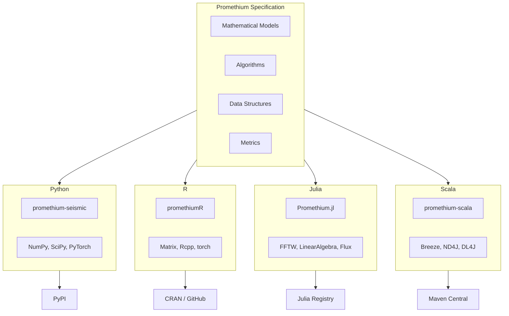
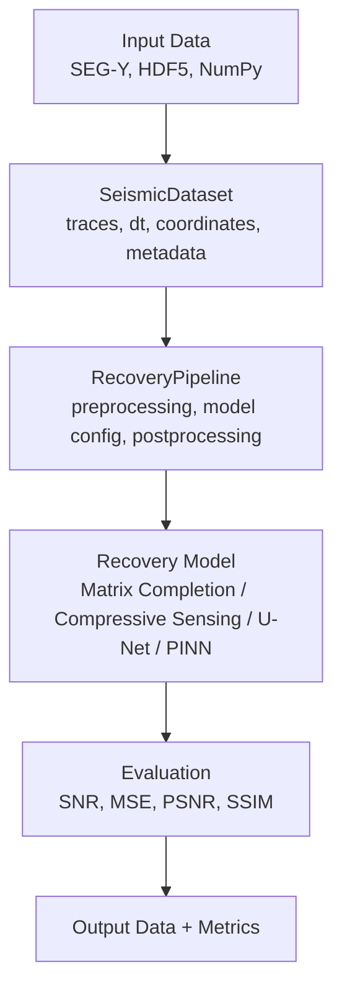

# Architecture Overview

This document describes the high-level architecture of Promethium as a multi-language seismic data recovery framework.

## Design Philosophy

Promethium is implemented as **four independent native libraries** that share a common mathematical specification but have **no runtime inter-language dependencies**. Each implementation is a first-class citizen in its respective ecosystem.

## Core Principles

1. **Specification First**: All implementations derive from a shared mathematical and algorithmic specification.

2. **Native Implementations**: Each language uses idiomatic constructs and native libraries, with no FFI or bridges to other languages.

3. **Cross-Language Consistency**: Given identical inputs and parameters, all implementations produce numerically consistent results within defined tolerances.

4. **Ecosystem Integration**: Each implementation integrates naturally with its ecosystem (PyPI, CRAN, Julia Registry, Maven Central).

## System Architecture

## Package Structure

### Python

Location: `src/promethium/`

| Directory | Purpose |
|-----------|---------|
| `core/` | Configuration, logging, exceptions |
| `io/` | SEG-Y, MiniSEED, HDF5, cloud storage |
| `signal/` | Filters, transforms, deconvolution |
| `ml/` | U-Net, autoencoder, GAN, PINN |
| `pipelines/` | SeismicRecoveryPipeline |
| `evaluation/` | Metrics (SNR, MSE, PSNR, SSIM) |
| `cli/` | Command-line interface |
| `api/` | FastAPI backend (optional) |

### R

Location: `packages/promethiumR/`

| File | Purpose |
|------|---------|
| `DESCRIPTION` | Package metadata |
| `NAMESPACE` | Exports |
| `R/dataset.R` | SeismicDataset S3 class |
| `R/metrics.R` | Evaluation functions |
| `R/recovery.R` | ISTA, FISTA, Wiener |
| `R/pipeline.R` | Pipeline orchestration |
| `R/io.R` | Data I/O |
| `tests/testthat/` | Unit tests |

### Julia

Location: `packages/Promethium.jl/`

| File | Purpose |
|------|---------|
| `Project.toml` | Package manifest |
| `src/Promethium.jl` | Main module |
| `src/types.jl` | SeismicDataset, VelocityModel |
| `src/metrics.jl` | Evaluation metrics |
| `src/recovery.jl` | Matrix completion, FISTA |
| `src/signal.jl` | Wiener filter, transforms |
| `src/pipeline.jl` | RecoveryPipeline |
| `test/runtests.jl` | Test suite |

### Scala

Location: `packages/promethium-scala/`

| Directory | Purpose |
|-----------|---------|
| `core/` | SeismicDataset, VelocityModel, Pipeline |
| `evaluation/` | Metrics |
| `recovery/` | MatrixCompletion, CompressiveSensing |
| `signal/` | Filters |
| `io/` | PromethiumIO |

## Data Flow

## Algorithm Categories

### Classical Signal Processing

| Algorithm | Purpose |
|-----------|---------|
| Wiener filtering | Frequency-domain denoising |
| Adaptive filters | LMS, Kalman variants |
| Deconvolution | Wavelet recovery |
| Time-frequency | STFT, wavelet transforms |

### Optimization-Based Recovery

| Algorithm | Method |
|-----------|--------|
| Matrix completion | Nuclear norm minimization (ISTA) |
| Compressive sensing | L1 minimization (FISTA) |
| Sparse representation | Matching pursuit, basis pursuit |

### Deep Learning

| Model | Application |
|-------|-------------|
| U-Net | Interpolation and denoising |
| Autoencoder | Unsupervised denoising |
| GAN | High-fidelity reconstruction |
| PINN | Physics-constrained recovery |

## Cross-Language Validation

All implementations are validated against shared test vectors stored in `testdata/` and `tests/cross_language/`.

| Type | Absolute Tolerance | Relative Tolerance |
|------|-------------------|-------------------|
| Metric values | 1e-6 | 1e-4 |
| Signal arrays | 1e-8 | 1e-6 |

## Versioning

All language implementations share synchronized major.minor versions:

| Language | Package | Current Version |
|----------|---------|-----------------|
| Python | `promethium-seismic` | 1.0.4 |
| R | `promethiumR` | 1.0.4 |
| Julia | `Promethium.jl` | 1.0.4 |
| Scala | `promethium-scala` | 1.0.4 |
