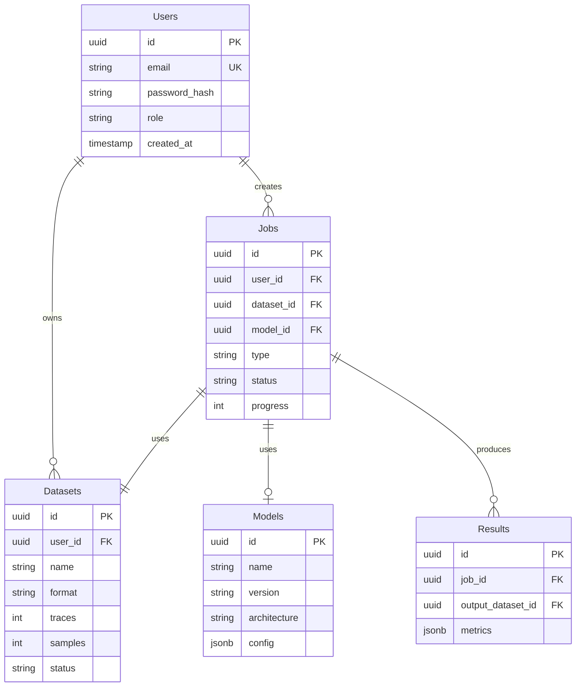

# Data Models

This document describes the database schema and data models in Promethium. The schema design follows state-of-the-art practices for scalable, maintainable data persistence in production ML systems.

## Entity Relationship Diagram



---

## Core Entities

### Users

| Column | Type | Description |
|--------|------|-------------|
| id | UUID | Primary key |
| email | VARCHAR(255) | Unique email |
| password_hash | VARCHAR(255) | Hashed password |
| role | VARCHAR(50) | User role |
| created_at | TIMESTAMP | Creation time |
| updated_at | TIMESTAMP | Last update |

### Datasets

| Column | Type | Description |
|--------|------|-------------|
| id | UUID | Primary key |
| user_id | UUID | Owner reference |
| name | VARCHAR(255) | Dataset name |
| format | VARCHAR(50) | File format |
| traces | INTEGER | Number of traces |
| samples | INTEGER | Samples per trace |
| sample_rate | FLOAT | Sample rate (Hz) |
| size_bytes | BIGINT | File size |
| status | VARCHAR(50) | Processing status |
| storage_path | VARCHAR(500) | Storage location |
| metadata | JSONB | Additional metadata |
| created_at | TIMESTAMP | Creation time |

### Jobs

| Column | Type | Description |
|--------|------|-------------|
| id | UUID | Primary key |
| user_id | UUID | Owner reference |
| dataset_id | UUID | Input dataset |
| model_id | UUID | Model reference |
| type | VARCHAR(50) | Job type |
| status | VARCHAR(50) | Job status |
| progress | INTEGER | Completion percentage |
| parameters | JSONB | Job parameters |
| error_message | TEXT | Error details |
| started_at | TIMESTAMP | Start time |
| completed_at | TIMESTAMP | Completion time |
| created_at | TIMESTAMP | Creation time |

### Models

| Column | Type | Description |
|--------|------|-------------|
| id | UUID | Primary key |
| name | VARCHAR(255) | Model name |
| version | VARCHAR(50) | Version string |
| architecture | VARCHAR(100) | Architecture type |
| type | VARCHAR(50) | Model type |
| storage_path | VARCHAR(500) | Storage location |
| config | JSONB | Model configuration |
| metrics | JSONB | Performance metrics |
| created_at | TIMESTAMP | Creation time |

### Results

| Column | Type | Description |
|--------|------|-------------|
| id | UUID | Primary key |
| job_id | UUID | Job reference |
| output_dataset_id | UUID | Output dataset |
| metrics | JSONB | Quality metrics |
| storage_path | VARCHAR(500) | Storage location |
| created_at | TIMESTAMP | Creation time |

---

## Status Enumerations

### Dataset Status

| Value | Description |
|-------|-------------|
| uploading | File upload in progress |
| processing | Initial processing |
| ready | Available for use |
| error | Processing failed |

### Job Status

| Value | Description |
|-------|-------------|
| pending | Queued for execution |
| running | Currently executing |
| completed | Successfully finished |
| failed | Execution failed |
| cancelled | User cancelled |

---

## Indexes

```sql
CREATE INDEX idx_datasets_user ON datasets(user_id);
CREATE INDEX idx_jobs_user ON jobs(user_id);
CREATE INDEX idx_jobs_status ON jobs(status);
CREATE INDEX idx_jobs_created ON jobs(created_at);
```

---

## Related Documents

| Document | Description |
|----------|-------------|
| [Architecture](architecture.md) | System architecture |
| [API Reference](api-reference.md) | API documentation |
