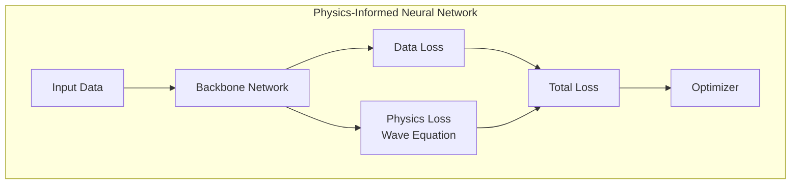

# ML Pipelines

This document covers state-of-the-art machine learning architectures, training, and inference in Promethium. Developed in December 2025, the framework incorporates cutting-edge deep learning approaches for seismic reconstruction.

## Model Architectures

### U-Net

The state-of-the-art U-Net architecture is the primary model for seismic trace reconstruction with encoder-decoder structure and skip connections.

**Configuration:**

```yaml
model:
  architecture: unet
  params:
    in_channels: 1
    out_channels: 1
    features: [64, 128, 256, 512]
    bottleneck: 1024
    dropout: 0.1
```

**Variants:**
- **Attention U-Net**: Attention gates at skip connections
- **Residual U-Net**: Residual blocks for better gradient flow

### Variational Autoencoder (VAE)

Probabilistic model for uncertainty-aware reconstruction.

```yaml
model:
  architecture: vae
  params:
    latent_dim: 256
    encoder_features: [64, 128, 256]
    beta: 1.0
```

### GAN

Adversarial training for high-fidelity reconstruction.

```yaml
model:
  architecture: gan
  params:
    generator:
      architecture: unet
    discriminator:
      architecture: patchgan
    adversarial_weight: 0.01
```

### Physics-Informed Neural Network (PINN)

State-of-the-art PINN architecture incorporates wave equation constraints into training, representing cutting-edge scientific machine learning.



```yaml
model:
  architecture: pinn
  params:
    backbone: unet
    physics_weight: 0.1
    wave_equation: acoustic
```

---

## Training Pipeline

### Data Preparation

```yaml
data:
  train_path: /data/train/
  val_path: /data/val/
  patch_size: 256
  stride: 128
  augmentation:
    enable: true
    noise_std: 0.01
```

### Training Configuration

```yaml
training:
  epochs: 100
  batch_size: 16
  optimizer:
    type: adamw
    learning_rate: 1e-4
  scheduler:
    type: reduce_on_plateau
    factor: 0.5
    patience: 10
  mixed_precision: true
```

### Distributed Training

```bash
torchrun --nproc_per_node=4 train.py --config config.yaml
```

---

## Inference Pipeline

### Patch-Based Inference

Large inputs are processed as overlapping patches with cosine-weighted blending.

```yaml
inference:
  batch_size: 8
  patch_size: 256
  overlap: 0.5
  device: cuda
  precision: float16
```

### Ensemble Inference

```yaml
inference:
  ensemble_size: 5
  dropout_inference: true
  aggregate: mean
```

---

## Evaluation Metrics

| Metric | Description | Range |
|--------|-------------|-------|
| SNR Improvement | SNR gain in dB | Higher better |
| SSIM | Structural Similarity | [0, 1] |
| MSE | Mean Squared Error | Lower better |
| Coherence | Cross-correlation | [0, 1] |

---

## Model Registry

Models are tracked with MLflow:

```python
import mlflow

with mlflow.start_run():
    mlflow.log_params(config)
    mlflow.pytorch.log_model(model, "model")
```

---

## Related Documents

| Document | Description |
|----------|-------------|
| [Data Engineering](data-engineering.md) | Data pipeline documentation |
| [Benchmarking](benchmarking.md) | Performance evaluation |
