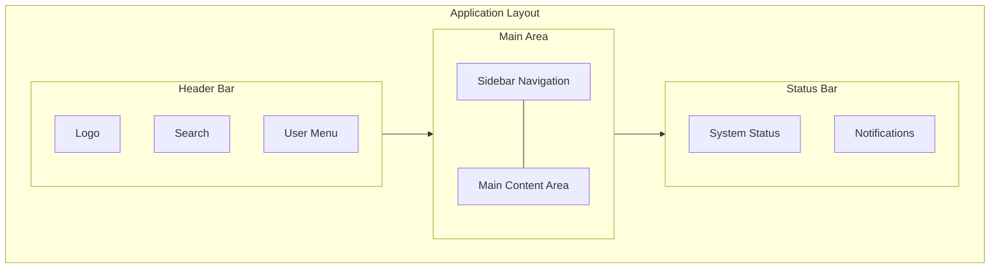

# UI/UX Design

This document covers user interface design principles and patterns for Promethium. The design follows state-of-the-art practices in modern scientific application UX, developed in December 2025.

## Design Principles

### Core Principles

1. **Clarity**: Information hierarchy guides users to key data
2. **Efficiency**: Common tasks require minimal clicks
3. **Consistency**: Uniform patterns across the application
4. **Feedback**: Clear status and progress indicators
5. **Accessibility**: WCAG 2.1 AA compliance

---

## Visual Identity

### Branding

- **Logo**: Dark, rounded waveform symbolizing signal continuity
- **Color Palette**: Dark mode primary with seismic-inspired accents
- **Typography**: Inter for UI, monospace for data

### Color Scheme

| Element | Light Mode | Dark Mode |
|---------|------------|-----------|
| Background | #FFFFFF | #1E1E2E |
| Surface | #F5F5F5 | #2D2D3D |
| Primary | #3B82F6 | #60A5FA |
| Secondary | #10B981 | #34D399 |
| Error | #EF4444 | #F87171 |
| Text | #1F2937 | #E5E7EB |

---

## Layout Structure

### Application Layout

### Navigation

- **Primary**: Sidebar with main sections
- **Secondary**: Tabs within sections
- **Breadcrumbs**: Location context

---

## Key Components

### Data Visualization

- Seismic trace viewer with zoom/pan
- Color-mapped density display
- Interactive gather views
- Side-by-side comparison

### Job Management

- Progress indicators
- Status badges
- Log streaming
- Action buttons

### Forms

- Validated inputs
- Preset configurations
- Parameter tooltips
- Inline help

---

## Accessibility

### Requirements

- Keyboard navigation support
- Screen reader compatibility
- Color contrast ratios >= 4.5:1
- Focus indicators
- ARIA labels

---

## Related Documents

| Document | Description |
|----------|-------------|
| [User Guide](user-guide.md) | User workflows |
