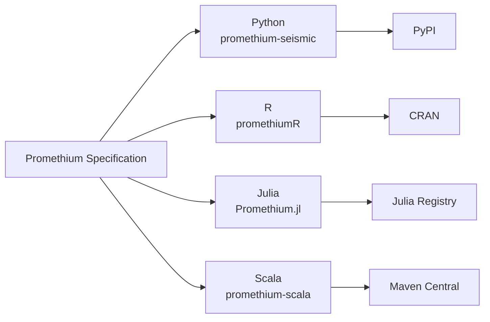

# Promethium Multi-Language Packages

This directory contains state-of-the-art (SoTA) native implementations of Promethium in multiple programming languages.

## Package Overview



| Language | Package | Path | Version | Status |
|----------|---------|------|---------|--------|
| Python | `promethium-seismic` | `../src/promethium/` | 1.0.4 | Production |
| R | `promethiumR` | `promethiumR/` | 1.0.4 | Complete |
| Julia | `Promethium.jl` | `Promethium.jl/` | 1.0.4 | Complete |
| Scala | `promethium-scala` | `promethium-scala/` | 1.0.4 | Complete |

## Design Principles

1. **Independent Native Implementations**: Each language implements algorithms directly from the shared specification with no runtime inter-language calls.

2. **Cross-Language Consistency**: All implementations produce numerically identical results (within tolerance) for the same inputs.

3. **Idiomatic APIs**: Each implementation uses language-native idioms while maintaining conceptual consistency.

## Shared Specification

See [Architecture Documentation](../docs/architecture.md) for the complete system overview.

## Quick Start

### Python

```bash
pip install promethium-seismic
```

```python
import promethium as pm
ds = pm.SeismicDataset(traces, dt=0.004)
pipe = pm.SeismicRecoveryPipeline.from_preset("matrix_completion")
result = pipe.run(ds)
```

### R

```r
# From source
devtools::install("packages/promethiumR")

library(promethiumR)
ds <- SeismicDataset(matrix(rnorm(1000), 10, 100), dt = 0.004)
pipe <- promethium_pipeline("matrix_completion")
result <- promethium_run(pipe, ds)
```

### Julia

```julia
using Pkg
Pkg.develop(path="packages/Promethium.jl")

using Promethium
ds = SeismicDataset(randn(100, 500), 0.004)
pipe = from_preset("matrix_completion")
result = run(pipe, ds)
```

### Scala

```scala
// Add to build.sbt
libraryDependencies += "io.promethium" %% "promethium-scala" % "1.0.4"

import io.promethium.core._
val ds = SeismicDataset(traces, dt = 0.004)
val pipe = RecoveryPipeline.fromPreset("matrix_completion")
val result = pipe.run(ds)
```

## Testing

All implementations are validated against shared test vectors:

```bash
# Python
pytest tests/cross_language/

# R
Rscript -e "testthat::test_dir('packages/promethiumR/tests')"

# Julia
julia --project=packages/Promethium.jl -e "using Pkg; Pkg.test()"

# Scala
cd packages/promethium-scala && sbt test
```

## Numerical Tolerances

| Metric Type | Absolute | Relative |
|-------------|----------|----------|
| Metric values | 1e-6 | 1e-4 |
| Signal arrays | 1e-8 | 1e-6 |
